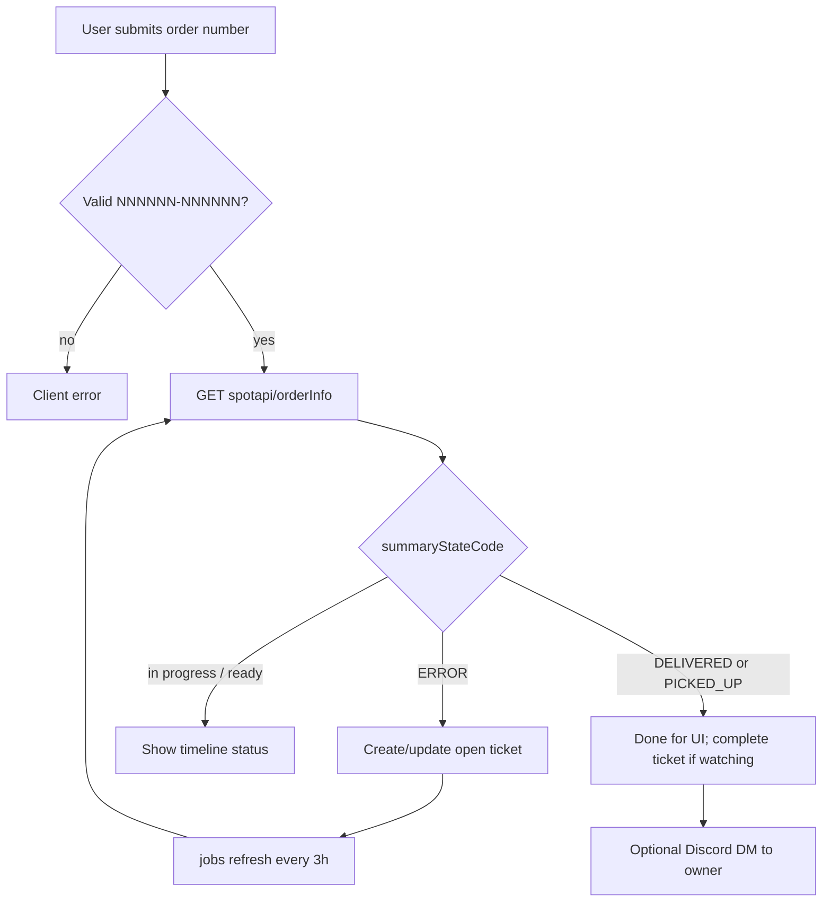
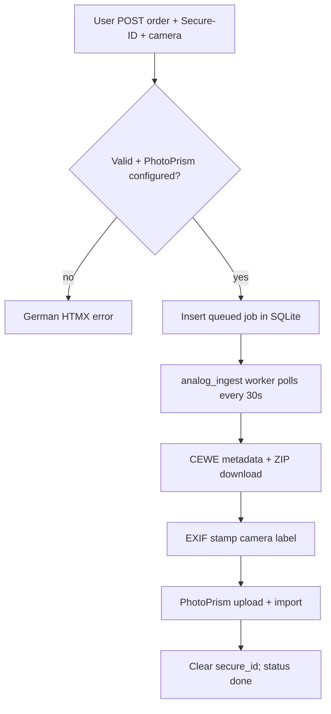

# Architecture

## Module map

```
src/
  main.rs              Router, session layer, spawn background workers
  config.rs            Env → Config (PhotoPrism, analog ingest dir)
  state.rs             AppState { db, config, oauth, http }
  models.rs            User, Ticket, AnalogIngestJob + status constants
  db.rs                Pool init, migrations, all SQL
  dm_order.rs          Order number validation + spot.photoprintit.com client + timeline
  dm_analog.rs         CEWE analog download client (metadata, ZIP extract)
  camera_exif.rs       Camera label → EXIF Make/Model stamp
  photoprism.rs        PhotoPrism `/api/v1` stage upload + import commit
  discord_bot.rs       Discord REST: open DM channel + send message
  jobs/                Background workers
    mod.rs             Re-exports
    ticket_refresh.rs  3h ticket refresh + Discord DM on status change
    analog_ingest.rs   Poll queued ingest jobs; download → EXIF → PhotoPrism
  auth/
    discord.rs         OAuth client + Discord user fetch
    session.rs         AuthUser / AdminUser extractors, HTMX-aware rejections
    admin.rs           Password check helpers
  handlers/
    pages.rs           HTML pages + Discord OAuth start/callback + admin login
    api.rs             JSON / HTMX API (me, users, order check, tickets, admin actions)
    analog_ingest.rs   HTMX analog ingest form submit + job list partial
    tickets.rs         Ticket list template + OOB swap helper
templates/             Askama HTML (base, index, login, admin, partials/)
static/                styles.css, htmx.min.js
migrations/            SQLx numbered SQL migrations
```

## Request / auth model

1. **Public** — landing, login pages, Discord OAuth, admin login form.
2. **User session** — `session["user_id"]` → `AuthUser` loads `users` row. Missing/stale → redirect `/login` or HTMX 401.
3. **Admin session** — separate flag `session["is_admin"]` after password POST. Independent of Discord login. Missing → redirect `/admin/login` or HTMX 403.

Sessions: SQLite-backed `tower-sessions`, signed with `SESSION_SECRET`, 7-day inactivity expiry, `SameSite=Lax`, `HttpOnly`, `Secure=false` (flip when serving HTTPS).

## Order + ticket flow



Semantics (see `dm_order.rs`):

- **ERROR** — order not found / not initialized → worth tracking.
- **READY_STATES** (`SHIPPED`, `DELIVERED`, `PICKED_UP`) — UI “ready” badge.
- **DONE_STATES** (`DELIVERED`, `PICKED_UP`) — ticket `completed = true`; refresher may DM.
- Archived in UI: completed > 7 days ago (`Ticket::completed_before(7)`).

## Analog ingest flow



Worker details (`jobs/analog_ingest.rs`): claims one queued job per cycle (status → `downloading`), runs download/label/upload pipeline, clears `secure_id` on success, marks `failed` with error text on failure. Temp files live under `ANALOG_INGEST_DIR/<job_id>/` and are removed after each job.

## Background jobs

Both workers are spawned from `main.rs` via `jobs::`.

**Ticket refresher** (`jobs::spawn_ticket_refresher`): `tokio::time::interval` fires **immediately** on the first tick, so the first refresh runs shortly after startup, then every **3 hours**. Calls `refresh_open_tickets` (same path as admin refresh). Failures are logged per ticket; cycle continues.

**Analog ingest worker** (`jobs::spawn_analog_ingest_worker`): loops with a **30s** sleep between cycles. Each cycle claims and processes all queued jobs until the queue is empty.

## HTMX patterns

- Prefer fragment responses for interactive actions.
- After mutations that affect the user’s list, use `handlers::tickets::with_tickets_oob` to refresh `#tickets-list` via `hx-swap-oob`.
- Analog ingest list: `#analog-ingest-list` polls `GET /api/analog/ingest`; form `POST` swaps the same target.
- Auth extractors branch on `HX-Request` header.

## Templates

Askama `#[derive(Template)]` with `path = "..."` under `templates/`. `base.html` layout; `partials/tickets_list.html` and `partials/analog_ingest_list.html` for list fragments.

## Data access

All SQL lives in `db.rs`. Handlers call `db::*` only — do not scatter raw queries in handlers unless migrating carefully into `db.rs`.
