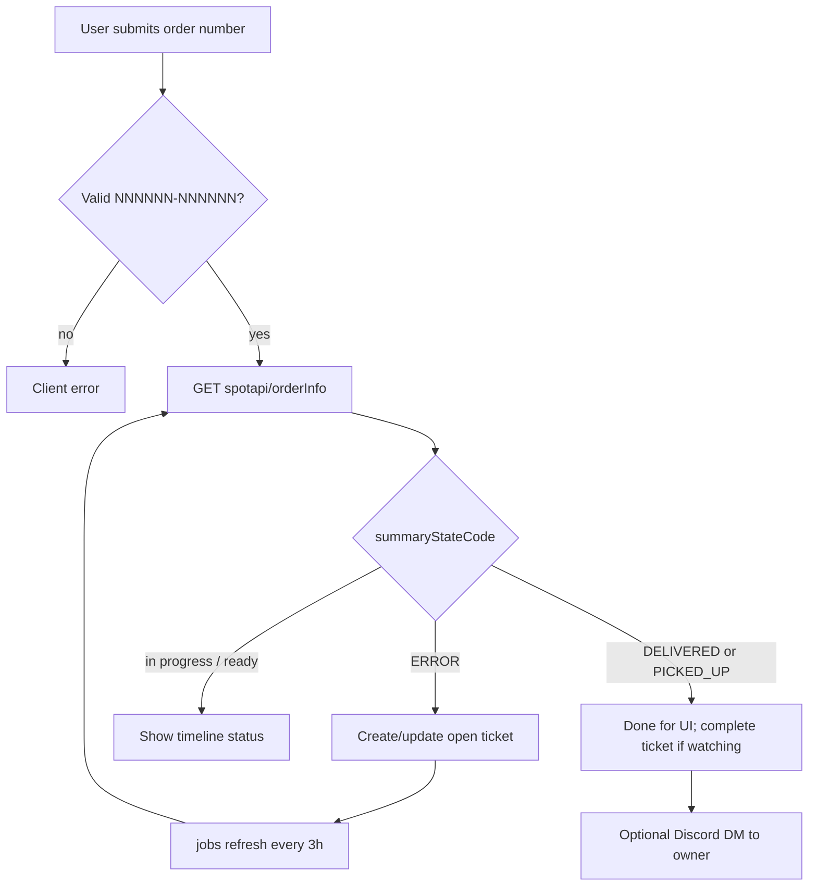

# Architecture

## Module map

```
src/
  main.rs           Router, session layer, job spawn
  config.rs         Env → Config
  state.rs          AppState { db, config, oauth, http }
  models.rs         User, Ticket
  db.rs             Pool init, migrations, all SQL
  dm_order.rs       Order number validation + spot.photoprintit.com client + timeline
  discord_bot.rs    Discord REST: open DM channel + send message
  jobs.rs           Background + shared ticket refresh / complete / DM
  auth/
    discord.rs      OAuth client + Discord user fetch
    session.rs      AuthUser / AdminUser extractors, HTMX-aware rejections
    admin.rs        Password check helpers
  handlers/
    pages.rs        HTML pages + Discord OAuth start/callback + admin login
    api.rs          JSON / HTMX API (me, users, order check, tickets, admin actions)
    tickets.rs      Ticket list template + OOB swap helper
templates/          Askama HTML (base, index, login, admin, partials/)
static/             styles.css, htmx.min.js
migrations/         SQLx numbered SQL migrations
```

## Request / auth model

1. **Public** — landing, login pages, Discord OAuth, admin login form.
2. **User session** — `session["user_id"]` → `AuthUser` loads `users` row. Missing/stale → redirect `/login` or HTMX 401.
3. **Admin session** — separate flag `session["is_admin"]` after password POST. Independent of Discord login. Missing → redirect `/admin/login` or HTMX 403.

Sessions: SQLite-backed `tower-sessions`, signed with `SESSION_SECRET`, 7-day inactivity expiry, `SameSite=Lax`, `HttpOnly`, `Secure=false` (flip when serving HTTPS).

## Order + ticket flow



Semantics (see `dm_order.rs`):

- **ERROR** — order not found / not initialized → worth tracking.
- **READY_STATES** (`SHIPPED`, `DELIVERED`, `PICKED_UP`) — UI “ready” badge.
- **DONE_STATES** (`DELIVERED`, `PICKED_UP`) — ticket `completed = true`; refresher may DM.
- Archived in UI: completed > 7 days ago (`Ticket::completed_before(7)`).

## Background job

`jobs::spawn_ticket_refresher` skips first interval tick, then every **3 hours** calls `refresh_open_tickets` (same path as admin refresh). Failures are logged per ticket; cycle continues.

## HTMX patterns

- Prefer fragment responses for interactive actions.
- After mutations that affect the user’s list, use `handlers::tickets::with_tickets_oob` to refresh `#tickets-list` via `hx-swap-oob`.
- Auth extractors branch on `HX-Request` header.

## Templates

Askama `#[derive(Template)]` with `path = "..."` under `templates/`. `base.html` layout; `partials/tickets_list.html` for list fragment.

## Data access

All SQL lives in `db.rs`. Handlers call `db::*` only — do not scatter raw queries in handlers unless migrating carefully into `db.rs`.
