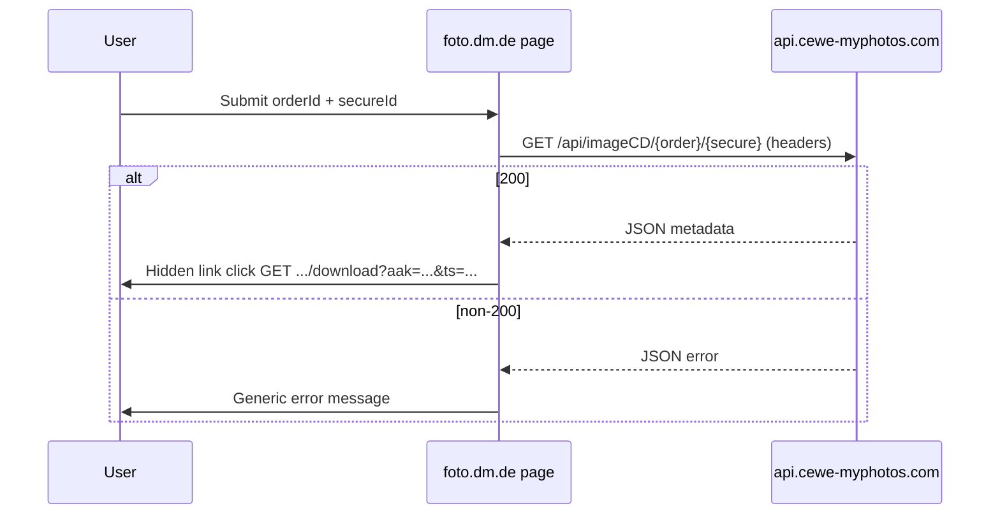

# Research — dm analog photo download API (CEWE / PhotoPrintIt)

- **Date:** 2026-08-06
- **Author:** ai
- **PR / branch:** `feat/dm-analog-ingest-slice-download` (local; not merged)
- **Status:** proposed

## Context

REQ-005 needs a server-side client to download dm analog development scans without browser automation. The public entry point is [foto.dm.de analog download](https://foto.dm.de/fotos/analog/download.html?ofqrcode=true). Credentials: 12-digit order number (`544850-103396`, format `^\d{6}-\d{6}$`) and Secure-ID (`H5GGX3T5`, 8-char alphanumeric, case-sensitive).

Research method: fetch live HTML/JS from `foto.dm.de`, inspect inline form handler, probe CEWE API with example credentials from REQ-005 (no full ZIP persisted in repo).

## Page flow (`foto.dm.de`)

| Item | Value |
|------|--------|
| URL | `https://foto.dm.de/fotos/analog/download.html` (`?ofqrcode=true` is marketing/QR entry; same page JS, no pre-fill observed) |
| Module id | `cp-photos:analog:cd-download` (meta `globalName`) |
| Form fields | `orderId` (placeholder `123456-123456`), `secureId` (placeholder `a1b2c3d4`) |
| Client-side validation | Empty fields → `#cd-download-form-invalid`; tracking events `ERROR_VALIDATION_ORDER_ID`, `ERROR_VALIDATION_SECURE_ID` |
| Partner | CEWE (myPhotos upsell block on success) |
| dm key account | `1320`, country `DE`, language `de` (embedded page config) |

Inline script (in page HTML, not a separate bundle) implements the download logic. `tracking.js` is analytics only (`@cewe/merlinjs` datalayer).

## API endpoints

### Primary (current production in page JS)

| Step | Method | URL | Auth |
|------|--------|-----|------|
| **Availability / metadata** | `GET` | `https://api.cewe-myphotos.com/api/imageCD/{orderId}/{secureId}` | Headers: `apiAccessKey`, `clientVersion` |
| **ZIP download** | `GET` | `https://api.cewe-myphotos.com/api/imageCD/{orderId}/{secureId}/download` | Same headers (sufficient for server client). Browser also appends query `?aak={apiAccessKey}&clientVersion={clientVersion}&ts={ms}` because `<a href>` cannot send headers. |

### Legacy alias (commented in JS, still works)

| Step | URL |
|------|-----|
| Metadata | `https://cmp.photoprintit.com/api/2.0/api/imageCD/{orderId}/{secureId}` |
| Download | `https://cmp.photoprintit.com/api/2.0/api/imageCD/{orderId}/{secureId}/download` |

Both hosts return identical metadata and the same ZIP (`Content-Length: 21643600` for test order). Prefer `api.cewe-myphotos.com` to match current page JS; keep photoprintit URL as fallback if CEWE renames CDN.

### Embedded public constants (from page JS)

```
apiAccessKey: 54a614716eb29ef3a3f004a6241e5e19
clientVersion: 1.0.0
```

These are **site-wide** keys (visible in public HTML), not per-user secrets. User authorization is `{orderId}/{secureId}` in the path.

## Response shapes

### Metadata (HTTP 200)

```json
{"labId":"544850-103396","orderTs":1782684000000,"deletedAtTs":1786356600000}
```

- `labId` mirrors order id.
- Timestamps are **epoch milliseconds** (UTC).
- Example: `orderTs` → 2026-06-28, `deletedAtTs` → 2026-08-10 (~42.5 days later), consistent with dm’s “~6 weeks” download window in REQ-005.
- Use `deletedAtTs` for expiry UX before attempting large ZIP download.

### Download (HTTP 200)

- `Content-Type: application/zip`
- `Content-Disposition: attachment; filename="{orderId}.zip"`
- Single ZIP archive; no per-image REST path found (`/files` → 404).

## Error cases (observed)

| HTTP | JSON `code` | When | UI / notes |
|------|-------------|------|------------|
| 401 | `3` | Missing/wrong `apiAccessKey` | Generic `#cd-download-error-message` |
| 404 | `2` | Wrong Secure-ID, unknown order, or wrong case (`h5ggx3t5` fails) | Same generic German error |
| 400 | `151` | Malformed order id (message: `Expects the format: {batchId}-{photoId}`) | Not distinguished in UI |
| 401 | — | Download URL with query `aak` only, no headers | Server client should use headers on `/download` |

Page JS treats **any non-200** on the metadata `fetch` as failure (`ERROR_REQUEST`); no granular error mapping to user-facing copy.

Client-side only: empty fields before network call.

**Not tested:** post-`deletedAtTs` expiry (need expired fixture), rate limiting, partial download / resume.

## Browser vs server implementation



**Recommended Rust client:**

1. `GET` metadata with headers → validate 200, parse `deletedAtTs`.
2. `GET` `{base}/{orderId}/{secureId}/download` with same headers → stream ZIP to temp file.
3. No browser, cookies, or CSRF tokens required.
4. Optional: skip metadata step and download directly; metadata step enables expiry check and smaller failure payload.

## Credential validation rules (inferred)

| Field | Rule | Evidence |
|-------|------|----------|
| Order | `^\d{6}-\d{6}$` | Placeholder, REQ-005, API code `151` |
| Secure-ID | 8 chars, `[A-Z0-9]` (case-sensitive) | Example `H5GGX3T5`; lowercase and 7-char variants → 404 code `2` |

Exact charset on flyer may include only uppercase; validate length 8 strictly.

## Risks and unknowns

1. **Public `apiAccessKey` rotation** — if CEWE rotates the key, page HTML must be re-scraped or key moved to env with monitoring.
2. **Key is not a user secret** — path credentials are the real gate; treat Secure-ID as sensitive at rest (REQ-005).
3. **No file manifest API** — must unzip locally; unknown internal folder/filename convention until fixture ZIP is inspected in implementation slice.
4. **Expiry after `deletedAtTs`** — behavior unverified (likely 404 code `2`).
5. **Terms of use** — automated download for personal orders is in scope; bulk/third-party use is out of scope per REQ-005.
6. **CORS** — `Access-Control-Allow-Origin: https://foto.dm.de` only; irrelevant for server-side Rust client.

## Decisions (proposed for parent review)

- Implement against `https://api.cewe-myphotos.com/api/imageCD/` with photoprintit fallback env override.
- Store `apiAccessKey` + `clientVersion` in `.env` (defaults from page JS); document re-sync from HTML if downloads fail with 401 code `3`.
- Two-phase client: metadata then ZIP stream; surface `deletedAtTs` in job errors.
- Do not use browser automation.

## Follow-ups

- [ ] Parent agent: approve API host + header contract before `src/` work.
- [ ] Implementation slice: download one fixture ZIP, document internal paths and image formats (JPEG/TIF).
- [ ] Add HTTP fixture tests with recorded metadata JSON and mock ZIP bytes (no live credentials in CI).
