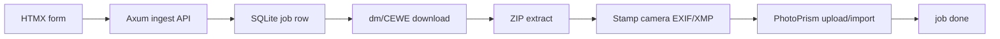

# Plan — DM analog download → PhotoPrism (REQ-005)

**Date:** 2026-08-06  
**Status:** planning only (no product implementation yet)  
**Parent branch:** `feat/dm-analog-ingest`

## Problem

dm analog development includes a time-limited digital download (order number + Secure-ID on [foto.dm.de download](https://foto.dm.de/fotos/analog/download.html?ofqrcode=true)). Manual download + import into PhotoPrism is tedious. This site should automate: download → stamp camera metadata → PhotoPrism.

## PhotoPrism API (yes)

PhotoPrism exposes a REST API under `/api/v1` ([docs](https://docs.photoprism.app/developer-guide/api/)):

- Auth: `POST /api/v1/session` or app password / `Authorization: Bearer` / `X-Auth-Token`
- Web upload used by the UI: `POST /api/v1/users/{userUid}/upload/{token}` (multipart files), then `PUT` same path to import (optional `albums`)
- Alternatives: WebDAV into originals/import, or drop files into import volume + trigger index/import
- No formal deprecation policy; prefer stable session + upload flow, pin behavior with integration tests against a homelab instance

Detail research lands on slice branch `feat/dm-analog-ingest-slice-photoprism`.

## Pipeline

1. User enters `544850-103396` + Secure-ID + camera label.
2. Job downloads ZIP (endpoint TBD by research slice).
3. Extract images; write Make/Model (or XMP) from camera label.
4. Upload to PhotoPrism; mark job complete; scrub Secure-ID.

## Branch / worker process

| Role | Branch | Owner |
|------|--------|-------|
| Integration | `feat/dm-analog-ingest` | Parent agent — merges only after review |
| Research: dm download | `feat/dm-analog-ingest-slice-download` | composer-2.5 worker |
| Research: metadata | `feat/dm-analog-ingest-slice-metadata` | composer-2.5 worker |
| Research: PhotoPrism | `feat/dm-analog-ingest-slice-photoprism` | composer-2.5 worker |

Rules:

- Workers create **docs-only** commits on slice branches first.
- Parent reviews, then merges slices → parent.
- **Implementation slices** (client, job, UI, PhotoPrism) start only after REQ-005 research checkboxes are satisfied / notes accepted.
- No direct commits to `main`; no force-push; parent opens PRs when asked.

## Later implementation PR stack (not started)

1. Migration + job model + stub status API  
2. dm download client + tests with fixtures  
3. EXIF/XMP stamp step  
4. PhotoPrism client + env  
5. HTMX UI form + status partial  

## Open questions

- Exact Secure-ID charset/length and download URL (needs live network capture or JS inspection).
- Whether dm ZIP already contains EXIF worth preserving (merge vs overwrite Make/Model).
- PhotoPrism: app password vs session cookie for long-running jobs.
- Temp disk path and retention for large ZIPs inside the container.

## Non-goals this session

- No Rust feature code.
- No live download with real credentials in CI.
- No PhotoPrism production deploy changes beyond documented env vars later.
