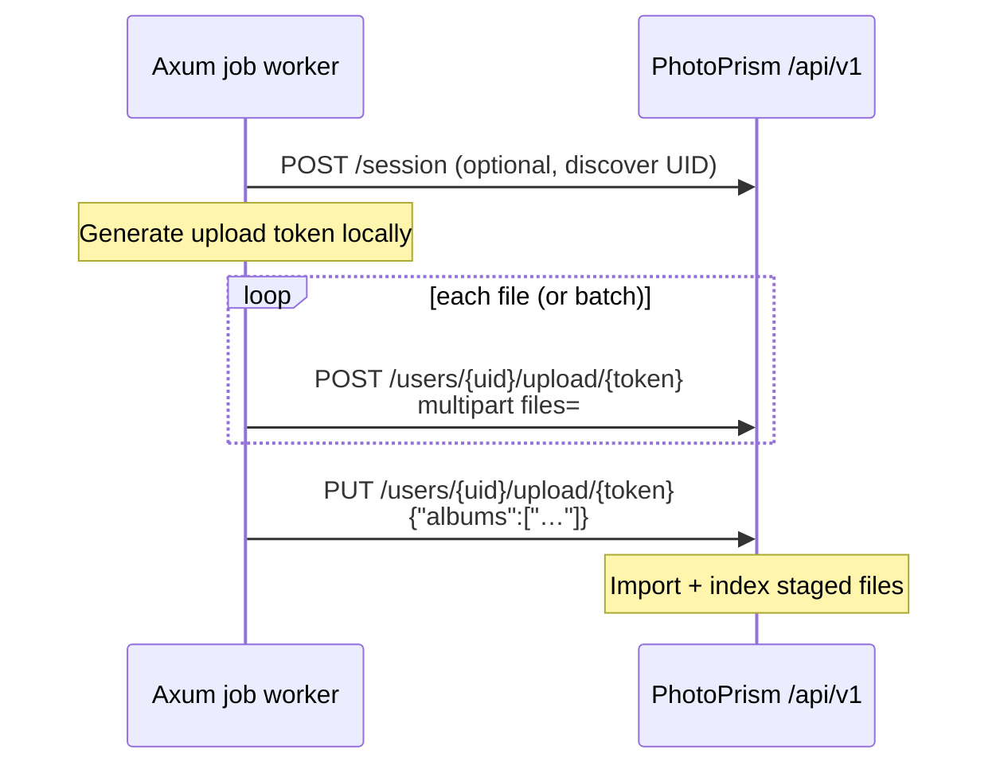

# PhotoPrism API research — upload / import for REQ-005

**Date:** 2026-08-06  
**Branch:** `feat/dm-analog-ingest-slice-photoprism`  
**Status:** research only (no product code)  
**Scope:** Programmatic ingest from dm-photo-website (Rust Axum homelab backend) into PhotoPrism

## Summary

PhotoPrism exposes a JSON REST API under `/api/v1`. The web UI upload path is the best fit for a remote backend: **multipart POST to stage files, then PUT to import/index**. Auth should use a **user-bound app password** as a Bearer token (not OAuth client credentials). Camera Make/Model for REQ-005 should be written into files **before** upload; PhotoPrism reads EXIF on import. Album assignment is supported in the PUT body; labels are a separate post-import API.

## Official documentation

| Topic | URL |
|-------|-----|
| API introduction | https://docs.photoprism.app/developer-guide/api/ |
| Client authentication (app passwords, access tokens, scopes) | https://docs.photoprism.app/developer-guide/api/auth/ |
| OAuth2 grant types & token endpoint | https://docs.photoprism.app/developer-guide/api/oauth2/ |
| User guide: client credentials | https://docs.photoprism.app/user-guide/users/client-credentials/ |
| Swagger (generated from source; interactive at docs.photoprism.dev) | https://docs.photoprism.app/developer-guide/api/docs/ |
| WebDAV sync | https://docs.photoprism.app/user-guide/sync/webdav/ |
| Import to originals | https://docs.photoprism.app/user-guide/library/import/ |
| Metadata support (EXIF read on index; no write-back to originals) | https://docs.photoprism.app/user-guide/library/metadata/ |
| EXIF extraction (Make/Model fields) | https://docs.photoprism.app/developer-guide/metadata/exif/ |
| Upload + albums (maintainer discussion, references frontend) | https://github.com/photoprism/photoprism/discussions/5151 |
| Import via API (cron example) | https://github.com/photoprism/photoprism/discussions/3692 |

Source-of-truth handlers (when docs lag): `internal/api/users_upload.go`, `internal/api/import.go`, `internal/api/index.go` in [photoprism/photoprism](https://github.com/photoprism/photoprism).

---

## Authentication options

### 1. App password (recommended for backend)

- Created in UI: **Settings → Account → Apps and Devices**, or CLI: `photoprism auth add -n dm-ingest -s "files photos albums" <username>`.
- Used **directly** as `Authorization: Bearer <app_password>` (or `X-Auth-Token`) — no session exchange required.
- Bound to a **user account**; required because upload endpoints enforce `session.UserUID == path uid`.
- Scopes: use `photoprism show scopes` on the instance; typical minimum `files`; add `photos`, `albums` if creating albums or labeling. Wildcard `*` works but is broader than needed.
- Docs: https://docs.photoprism.app/developer-guide/api/auth/

**Not suitable for upload/WebDAV:**

- **Client access tokens** (`photoprism auth add` without username) — not tied to a user account; cannot WebDAV-sync; upload likely fails UID check.
- **OAuth2 client credentials** (`POST /api/v1/oauth/token`, grant `client_credentials`) — service client session, not a user account.

### 2. Session login

| Endpoint | Method | Body | Response |
|----------|--------|------|----------|
| `/api/v1/session` | `POST` | `{"username":"…","password":"…"}` (password may be app password) | `access_token`, `session_id`, `user`, `config`, … |
| `/api/v1/session` | `GET` | — (Bearer or session header) | current session |
| `/api/v1/session` | `DELETE` | — | logout |

- Alias: `POST /api/v1/sessions` (same handler).
- Returns `user` object including **User UID** needed for upload URLs.
- 2FA: may return code `32` and require `{"code":"…"}` on retry.
- Older examples use `X-Session-ID: <session_id>`; modern clients should prefer `Authorization: Bearer <access_token>`.
- Docs: https://docs.photoprism.app/developer-guide/api/

### 3. OAuth2 token endpoint

| Endpoint | Method | Grants |
|----------|--------|--------|
| `/api/v1/oauth/token` | `POST` | `client_credentials`, PhotoPrism-specific `password`, `session` |
| `/api/v1/oauth/revoke` | `POST` | revoke token |
| `/.well-known/oauth-authorization-server` | `GET` | discovery |

- Authorization Code flow **not usable yet** (`/api/v1/oauth/authorize` is a placeholder).
- Docs: https://docs.photoprism.app/developer-guide/api/oauth2/

### Auth recommendation for dm-photo-website

Use a **long-lived app password** for a dedicated ingest user (e.g. `admin` or a service account with upload/import rights). Skip session creation unless we need one-time discovery of `user.UID` via `POST /api/v1/session`, then cache UID in env.

---

## Primary path: REST upload (POST → PUT)

Mirrors the web UI (`frontend/src/component/upload/dialog.vue`).

### Flow

### Endpoints

| Step | Method | Path | Content-Type | Body |
|------|--------|------|--------------|------|
| Stage file(s) | `POST` | `/api/v1/users/{uid}/upload/{token}` | `multipart/form-data` | field **`files`** (repeat for multiple) |
| Import staged | `PUT` | `/api/v1/users/{uid}/upload/{token}` | `application/json` | `{"albums":["album_uid_or_title"]}` — `albums` optional |

### Upload token `{token}`

- **Client-generated**, not returned by an API.
- Frontend uses `$util.generateToken()`: **7 characters**, `[a-z0-9]{7}` (see PR [#4971](https://github.com/photoprism/photoprism/pull/4971)).
- Purpose: isolate concurrent upload batches for the same user; server stores under `users/{uid}/upload/{sessionRef}{token}`.
- Rust: generate with `rand` / `nanoid` using lowercase alphanumeric, length 7.

### `{uid}`

- PhotoPrism user UID (e.g. `us56eo2vflczhcntsq`), from session response `user.UID` or env `PHOTOPRISM_USER_UID`.

### PUT import behavior (from source)

- Requires **Import feature enabled** and non-read-only mode.
- Moves staged files from user upload dir → import destination, runs import worker (copy/move into originals + index).
- Optional `albums` array: album UIDs or titles (requires album create/upload ACL).
- Publishes `import.completed`, `index.completed`, `upload.completed` events.

### Success / failure codes (POST)

- `200` — files accepted (check response message for count).
- `400` — bad multipart / rejected extensions.
- `401` / `403` — auth or UID mismatch / read-only / upload disabled.
- `413` — size limits (`UploadAllow`, per-file and total upload limits).
- `507` — insufficient storage.
- NSFW filter may return `403` if enabled and triggered.

---

## Fallback path: WebDAV + import API

Use when REST upload is blocked (reverse proxy body-size limits, multipart issues) or when sharing a Docker volume is awkward but WebDAV is already exposed.

### A. WebDAV drop + REST import trigger

1. **PUT files** via WebDAV to import folder URL:  
   `https://{user}@{host}/import/` (or `/originals/` for direct index — see below).  
   Docs: https://docs.photoprism.app/user-guide/sync/webdav/
2. **Trigger import:**  
   `POST /api/v1/import/`  
   `Content-Type: application/json`  
   `{"path":"","move":true,"albums":[]}`  
   - `path`: subfolder under import root (optional).  
   - `move`: remove from import folder after successful import.  
   - `albums`: same as upload PUT.  
   - Trailing slash route: `/api/v1/import/*path` also supported.

3. **Optional auto-import:** set `PHOTOPRISM_AUTO_IMPORT` (seconds delay) on PhotoPrism so WebDAV uploads trigger import without API call — less deterministic for job status.

Example cron/script: https://github.com/photoprism/photoprism/discussions/3692

### B. Shared volume + import or index CLI/API

If dm-photo-website runs beside PhotoPrism on the same host:

- Copy stamped files into PhotoPrism `import/` volume.
- Call `POST /api/v1/import/` as above, **or** run `photoprism import` in the container.

For files already in **originals** (not import):

- `POST /api/v1/index` with `{"path":"","rescan":false,"cleanup":false}` — indexes originals folder only; does **not** import from `import/`.

### WebDAV auth note

- Requires **username + account password or app password** (user-bound).
- OAuth/client access tokens **cannot** be used for WebDAV per docs.

---

## Albums

| Action | Method | Path | Body |
|--------|--------|------|------|
| Create album | `POST` | `/api/v1/albums` | `{"Title":"…","Favorite":false}` — restores soft-deleted manual album with same title |
| Search albums | `GET` | `/api/v1/albums` | query params |
| Add photos later | `POST` | `/api/v1/albums/{uid}/photos` | `{"photos":["photo_uid",…]}` |

**During ingest:** pass album UID(s) or title(s) in upload PUT or import POST `albums` array — simplest for REQ-005 batch album.

---

## Labels

Labels are **not** set during upload/import. After photos exist:

| Action | Method | Path | Body |
|--------|--------|------|------|
| Add label to photo | `POST` | `/api/v1/photos/{uid}/label` | `{"Name":"…","Uncertainty":10}` (form field `LabelName` in source) |
| Update label on photo | `PUT` | `/api/v1/photos/{uid}/label/{id}` | uncertainty, etc. |
| Remove label | `DELETE` | `/api/v1/photos/{uid}/label/{id}` | — |

For REQ-005, **camera identity via labels is out of scope** — requirement is EXIF Make/Model visible in camera filter.

---

## Camera Make / Model

| Approach | When | API |
|----------|------|-----|
| **Pre-stamp EXIF/XMP before upload** | **Preferred (REQ-005)** | None — PhotoPrism reads file metadata on import ([metadata docs](https://docs.photoprism.app/user-guide/library/metadata/)) |
| Post-import camera record fix | Admin correction | `GET /api/v1/cameras`, `PUT /api/v1/cameras/{id}` with `Make` / `Model` ([issue #5663](https://github.com/photoprism/photoprism/issues/5663)) |
| Update photo entity | After import | `PUT /api/v1/photos/{uid}` — limited fields; does not replace EXIF in file |

PhotoPrism **does not write metadata back to originals** ([discussion #1092](https://github.com/photoprism/photoprism/discussions/1092)). Pre-upload stamping is the correct integration point.

---

## Index vs import

| Endpoint | Purpose |
|----------|---------|
| `POST /api/v1/import/` | Copy/move from **import folder** (or upload staging) into originals + index |
| `POST /api/v1/index` | Scan **originals** for new/changed files |
| `DELETE /api/v1/import` | Cancel running import |
| `DELETE /api/v1/index` | Cancel running index |

Import options (`internal/form/import_options.go`): `albums`, `path`, `move`.  
Index options (`internal/form/index_options.go`): `path`, `rescan`, `cleanup` (cleanup admin-only).

---

## Recommendation

### Primary (Rust Axum homelab)

**REST upload: `POST` multipart → `PUT` JSON import**, authenticated with a **user app password** (`Authorization: Bearer`).

Rationale:

- Same path as the official UI — stable, well-tested in production.
- No WebDAV client dependency in Rust (reqwest multipart is enough).
- Works over HTTPS to a remote PhotoPrism instance.
- Album assignment in one PUT after all files staged.
- EXIF stamped locally before POST satisfies REQ-005 camera metadata.

Suggested Rust modules: thin `PhotoPrismClient` with `upload_files(uid, token, paths)` and `commit_upload(uid, token, albums)`.

### Fallback

**WebDAV PUT to `/import/` + `POST /api/v1/import/`** with `"move": true`.

Rationale:

- Useful if multipart upload hits proxy/body limits or needs resume-friendly large file transfer.
- Still needs REST for import trigger unless `PHOTOPRISM_AUTO_IMPORT` is enabled on the server.
- Requires WebDAV-capable Rust client (e.g. `reqwest_dav`) and user app password with `webdav` scope.

---

## Environment variables (proposed for implementation)

| Variable | Required | Description |
|----------|----------|-------------|
| `PHOTOPRISM_BASE_URL` | yes | e.g. `https://photos.home.arpa:2342` (no trailing slash) |
| `PHOTOPRISM_APP_PASSWORD` | yes* | User-bound app password (`files` + `albums` scopes as needed) |
| `PHOTOPRISM_USER_UID` | yes | Target user UID for `/users/{uid}/upload/…` |
| `PHOTOPRISM_DEFAULT_ALBUM` | no | Album UID or title for batch PUT `albums` |
| `PHOTOPRISM_USERNAME` | no | Only if using `POST /api/v1/session` instead of raw app password |
| `PHOTOPRISM_VERIFY_TLS` | no | Set `false` only for homelab self-signed (default true) |

\*Alternative: `PHOTOPRISM_ACCESS_TOKEN` if using a user-scoped token from `photoprism auth add <username>` — same Bearer usage.

Do **not** commit secrets; extend `.env.example` when implementation starts.

---

## Risks and constraints

| Risk | Mitigation |
|------|------------|
| **Undocumented upload API** — not fully described in public docs; relies on frontend/source | Pin PhotoPrism version in homelab; add integration test against real instance; monitor upstream releases |
| **No formal API deprecation policy** | Avoid undocumented endpoints beyond upload/import; watch release notes |
| **UID mismatch** — token must belong to same user as path `{uid}` | Dedicated ingest user; store UID in env after one-time session call |
| **Upload limits** — extension allowlist, per-file/total size, NSFW filter | Validate JPEG before upload; configure PhotoPrism `UploadAllow`; handle 413/403 in job errors |
| **Read-only / feature flags** — upload or import disabled | Check `GET /api/v1/config` at startup for `features.upload`, `features.import` |
| **Session expiry** if using session tokens | Prefer app password as Bearer directly |
| **OAuth client credentials won't upload as user** | Do not use for ingest |
| **Import/incomplete files over slow links** | Stage all POSTs before PUT; retry failed files; WebDAV auto-import delay if used |
| **Concurrent jobs** | Unique 7-char upload token per job batch |
| **Camera metadata** | Must stamp before upload; PhotoPrism won't write EXIF back to files |
| **Swagger unavailable in production builds** | Use linked docs + source; optional debug endpoint on dev instance |

---

## REQ-005 research checklist

- [x] Auth options documented (session, app password, OAuth limits)
- [x] Upload flow: POST + PUT with endpoint names and bodies
- [x] WebDAV / import folder / index alternatives documented
- [x] Album assignment via API documented
- [x] Camera Make/Model strategy aligned with EXIF pre-stamp
- [x] Labels API noted (post-import, optional)
- [x] Primary + fallback path chosen for Rust Axum homelab
- [x] Env vars and risks listed

## Next steps (parent / implementation — not this branch)

1. Parent merges this research into `feat/dm-analog-ingest`.
2. Add homelab integration test fixture (small JPEG POST+PUT against test PhotoPrism).
3. Implement `PhotoPrismClient` in Rust after metadata + download slices land.
